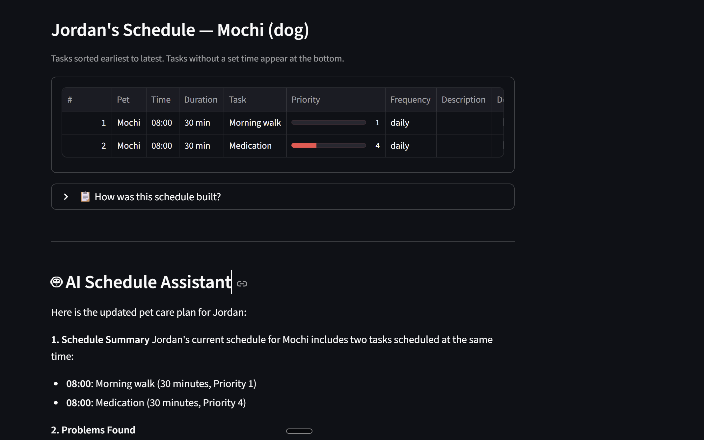
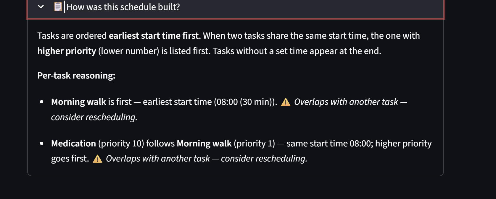
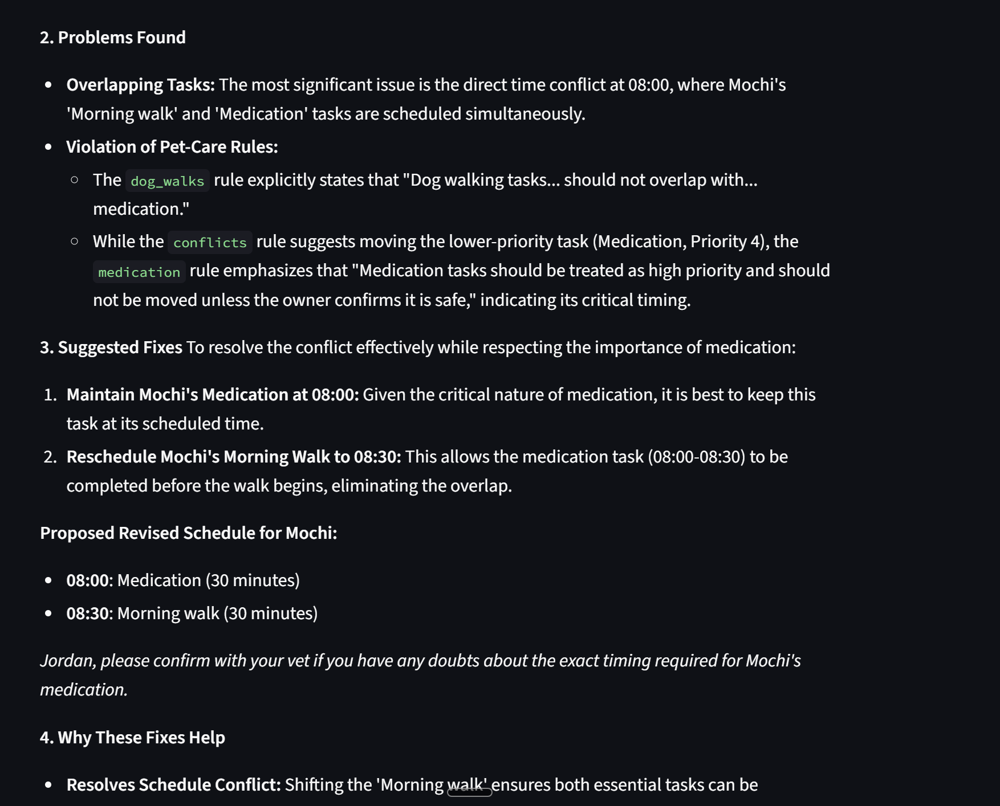
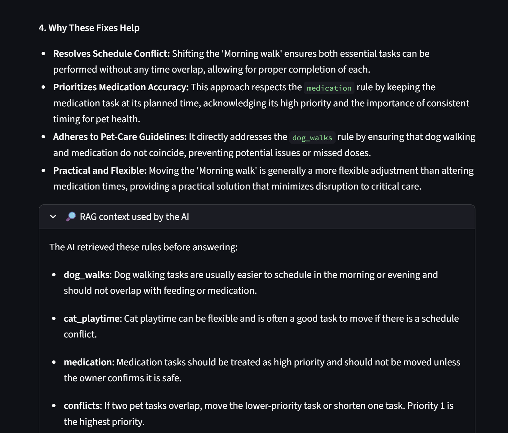

# PawPal+ RAG AI Schedule Assistant

## Title and Summary

PawPal+ is a pet-care scheduling app that helps pet owners organize daily care tasks for their pets. Users can add pets, create tasks, set times, assign priorities (1 being the highest priority and 10 being the lowest), detect schedule conflicts, and generate a daily plan.

For this updated version, I added a RAG-powered AI Schedule Assistant. The AI assistant uses the user's actual schedule, retrieves relevant pet-care rules, and generates helpful advice about conflicts, priorities, and possible schedule improvements.

This matters because busy pet owners often have repeated responsibilities like feeding, walking, grooming, medication, and vet appointments. PawPal+ helps organize those tasks and gives extra AI support when the schedule becomes confusing or conflicted.

---

## Original Base Project

The original project was **PawPal+**, my pet-care scheduling app. The base version allowed users to enter owner and pet information, add/edit/delete care tasks, assign task times and priorities, generate a schedule, and detect conflicts.

The original goal was to build a structured scheduling system using Python classes such as `Owner`, `Pet`, `Task`, and `Scheduler`, then connect that logic to a Streamlit interface. The updated version keeps the original scheduling logic but adds an AI feature that gives smarter explanations and suggestions.

---

## New AI Feature

The new feature is an **AI Schedule Assistant** that uses RAG.

Instead of asking the AI to respond with only general knowledge, the app first retrieves relevant pet-care and scheduling rules from a local knowledge base. Then it sends those retrieved rules, along with the user's current schedule and conflict warnings, to Gemini.

The AI can:

- Summarize the schedule
- Identify scheduling problems
- Explain conflicts
- Suggest better task arrangements
- Explain why the suggestions make sense

---

## Features

- Add pet-care tasks
- Edit and delete tasks
- Sort tasks by time
- Filter completed and pending tasks
- Detect overlapping schedule conflicts
- Generate schedule reasoning
- Retrieve relevant pet-care rules using RAG
- Generate AI schedule advice using Gemini
- Display the retrieved RAG context
- Log AI activity and errors safely

---

## AI Technique Used

This project uses **Retrieval-Augmented Generation**.

The retrieval part happens in `pet_knowledge.py`. This file stores pet-care scheduling rules, such as medication priority, feeding consistency, flexible grooming tasks, and conflict handling.

The generation part happens in `ai_schedule_assistant.py`. This file sends the current schedule, conflict warnings, schedule reasoning, and retrieved rules to Gemini. Gemini then generates a helpful response based on the actual schedule data.

---

## Architecture Overview

The system starts in `app.py`, which is the Streamlit user interface. The user enters pet tasks and clicks **Build Schedule**. The app then creates the owner, pet, and task objects and passes them into the scheduling system in `pawpal_system.py`.

The scheduler sorts tasks, checks for conflicts, and creates schedule reasoning. If the user enables AI advice, the app retrieves relevant rules from `pet_knowledge.py` and sends the schedule plus those rules to `ai_schedule_assistant.py`. That file calls Gemini and returns an AI-generated explanation, which is displayed back inside the Streamlit app.

---

## System Architecture Diagram


---

## Setup Instructions

### 1. Clone the repository

```bash
git clone https://github.com/mmuskann/applied-ai-system-project.git
```

### 2. Install dependencies

```bash
pip install -r requirements.txt
```

### 3. Update `.env.example` file

Update the file named `.env.example` in the main project folder to include your gemini api key.
After updating, rename the file to `.env`

The app can still run without the API key, but the AI Schedule Assistant will not generate AI advice unless the key is provided.

### 4. Run the Streamlit app

```bash
python -m streamlit run app.py
```

---

## Demo Interaction

Loom video link: #put link here 

Screenshot walkthrough:





---

## Sample Interactions

### Example 1: Medication and Feeding Conflict

**Input tasks:**

- Buddy: Medication at 08:00, priority 1
- Buddy: Feeding at 08:00, priority 2

**System behavior:**

The regular scheduler detects that both tasks overlap at the same time.

**Example AI output:**

The AI explains that medication should stay high priority because medication timing can be important. It suggests moving the lower-priority feeding task slightly earlier or later if the owner can do so. It also reminds the user to confirm medication timing with a vet if they are unsure.

---

### Example 2: Flexible Task Conflict

**Input tasks:**

- Buddy: Grooming at 17:00, priority 2
- Whiskers: Playtime at 17:00, priority 2

**System behavior:**

The scheduler detects that the two tasks happen at the same time.

**Example AI output:**

The AI explains that grooming and playtime are usually more flexible than feeding or medication. It suggests moving one task to a nearby open time, such as 17:30, so the owner can focus on one pet at a time.

---

### Example 3: Normal Schedule With No Conflict

**Input tasks:**

- Buddy: Morning Walk at 07:00, priority 1
- Buddy: Feeding at 08:00, priority 2
- Buddy: Vet Check-up at 09:00, priority 1

**System behavior:**

The scheduler sorts the tasks from earliest to latest and finds no conflicts.

**Example AI output:**

The AI summarizes the morning schedule and explains that the tasks are ordered clearly by time. It notes that the schedule is manageable because the tasks are spaced apart and there are no overlapping time slots.

---

## Design Decisions

I built the AI feature using RAG because I wanted the AI to respond based on the app's actual data instead of giving generic pet care advice. The local knowledge base in `pet_knowledge.py` keeps the rules simple and easy to understand. As we add more rules to the `pet_knowledge.py` the model becomes better and better.

I also made the AI feature optional with a checkbox. This way, the normal scheduling app still works even if the user does not have an API key or does not want to use AI.

Another design choice was to keep the original scheduling logic separate from the AI logic. The `pawpal_system.py` file handles scheduling, while `ai_schedule_assistant.py` handles the AI request. This makes the project easier to debug and maintain.

A trade-off is that the retrieval system is simple. It uses keyword matching instead of embeddings or a vector database. This makes the project easier to run and explain, but it is less advanced.
---

## Testing Summary

The core scheduling system was tested with unit tests using `pytest`.

The tests cover:

- Task creation and setter methods
- Adding and removing tasks from pets
- Adding and removing pets from owners
- Sorting tasks by time
- Filtering tasks by pet name and status
- Completing daily and weekly recurring tasks
- Detecting schedule conflicts

The AI feature was tested using human testing. I ran the app myself and worked through different scenarios  such as overlapping tasks, medication related tasks, flexible grooming and playtime tasks, and normal schedules with no conflicts. Then I reviewed the AI responses manually to check they were relevant, grounded, and safe.

What worked well:

- The app successfully detected conflicts.
- The AI responded based on the schedule and retrieved rules.
- The RAG context expander showed which rules were used.
- The app still worked when AI advice was not enabled.

What needed attention:

- The AI requires a valid Gemini API key.
- The app should not expose the `.env` file.
- The AI response depends on the quality of the task names and descriptions.
- The current retrieval system is simple and could be improved later with embeddings.

---

## Reflection

This project taught me how to connect AI to an existing application in a meaningful way. Instead of building a separate chatbot, I had to think about how AI could improve the actual workflow of the app. The biggest lesson was that AI works better when it has useful context. By retrieving pet-care rules first and then sending those rules with the live schedule, the AI gives more focused and helpful responses. I also learned that guardrails matter. Since pet care can involve medication, the AI should not act like a veterinarian or give unsafe medical advice. That is why the prompt tells the AI not to give veterinary diagnosis and to tell the user to confirm medication timing with a vet if unsure. Overall, this project helped me understand that building with AI is not just about calling an API. It is about designing the system around the AI so the response is useful, safe, and connected to the actual app.

